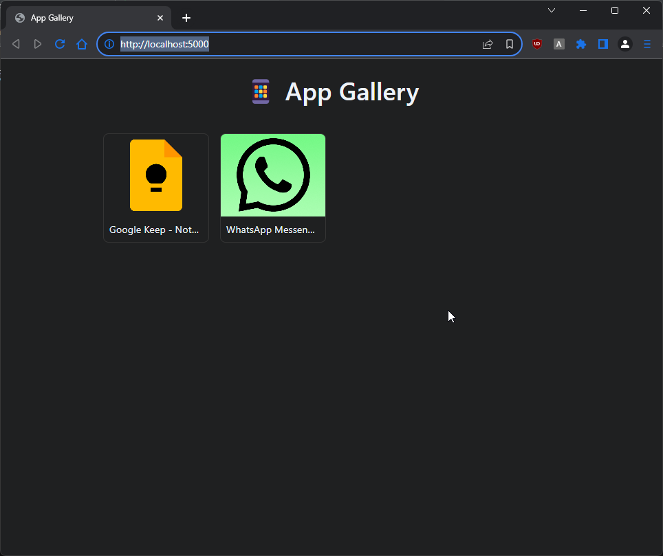

# PlayStore App Viewer

A Flask-based web app to browse and manage cached Google Play Store app data.

## Features

- 📱 Browse apps in a responsive thumbnail grid
- 🔍 View detailed app info (title, developer, score, description, screenshots)
- ➕ Add new apps via App ID or Play Store URL
- 💾 Automatically saves scraped data to `data/android/`
- 🖼️ Auto-extract App ID from pasted URLs
- 🚀 Fast, lightweight, and offline-friendly

## Screenshots



## Usage

1. **Add an App**
   - Click the **+ Add App** button
   - Paste a Play Store URL (e.g. `https://play.google.com/store/apps/details?id=com.whatsapp`) or App ID (e.g. `com.whatsapp`)
   - Auto-detection extracts the ID from URLs
   - Click "Add" to fetch and save

2. **View Details**
   - Click any app in the grid
   - See full metadata from Google Play

## Installation

```bash
git clone https://github.com/your-username/playstore-viewer.git
cd playstore-viewer
pip install -r requirements.txt
python app.p   

Call the save to cache and save the JSON of the app you want to add
for example
##com.google.android.keep
http://localhost:5000/save/com.google.android.keep